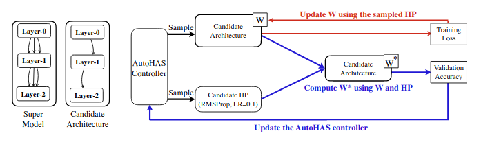

# AutoHAS
A complete, working PyTorch implementation of [AutoHAS](https://arxiv.org/pdf/2006.03656.pdf)

## What it does

At a high level, it works as follows:

* instantiate a categorical-policy based RL controller `controller`
* while `controller` has not converged:
    * sample `candidate_model`(s), `candidate_hyperparameter`(s) from `controller`
    * for each `candidate_model`, training on some training set using each `candidate_hyperparameter` as hyperparameters
    * create copy `candidate_model_copy` of each `candidate_model` and calculate each copy's `reward_signal` (probably as validation accuracy)
    * update `controller` policies using each `candidate_model_copy`'s `reward_signal` for policy gradient

As explained in the paper, we evaluate the validation accuracy of copies and not directly on the candidate models themselves to decouple the process of optimizing the shared network weights of the candidate models and the controller optimization step.

## How to use it

The main entry point is `train_controller.py` which contains all the logic for training an RL controller as specified in the AutoHAS paper. Specific requirements are included in `requirements.txt`, but you also need to do `pip install -e .` to install the AutoHAS module (called `module`) itself.

If you just want to see it working, you can just do `python train_controller.py`. By default, this trains a controller to create child models for MNIST. You can see training progress using Tensorboard (logs are saved to the `runs/` directory by default) with `tensorboard --logdir=runs`.